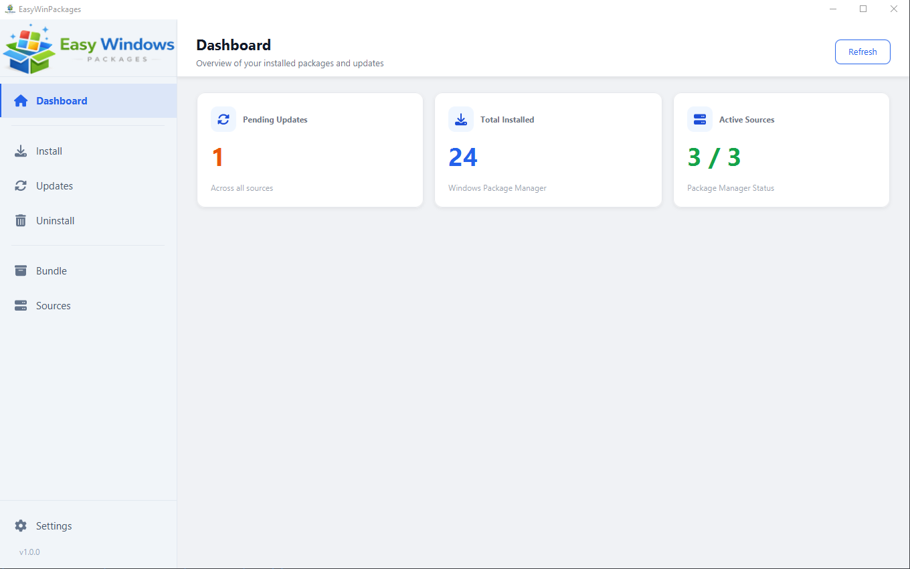
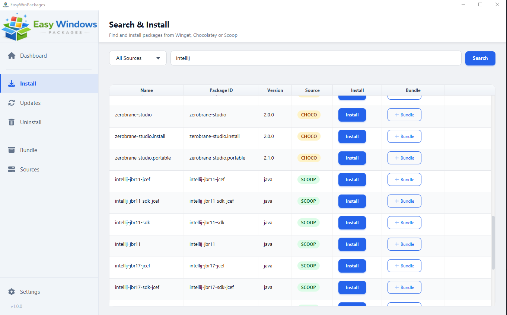
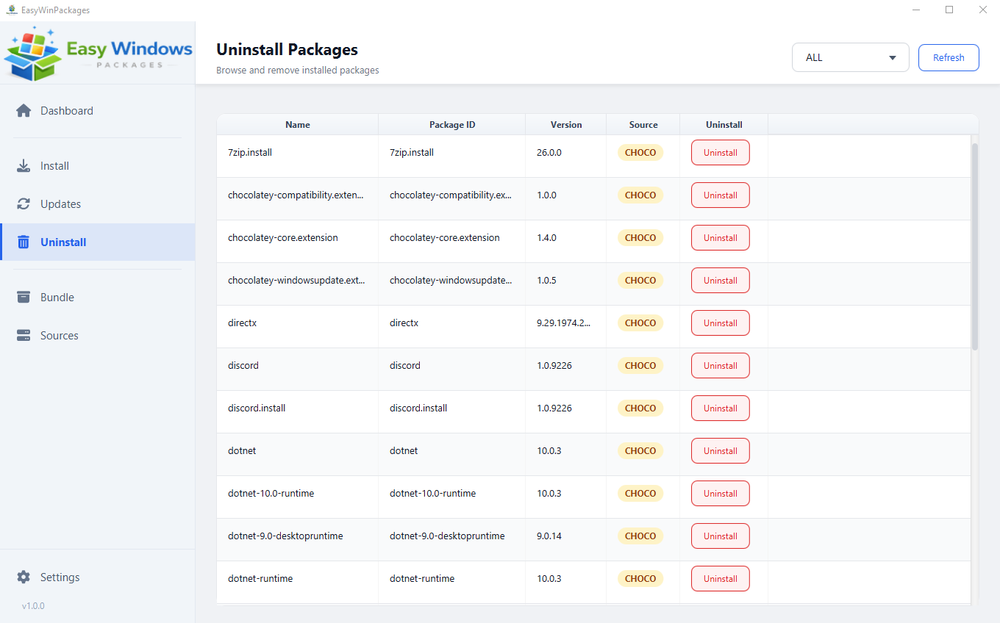

# EasyWinPackages

EasyWinPackages is a desktop app that lets you manage Windows packages from one place.
You can search, install, update, and remove packages using Winget, Chocolatey, and Scoop.

## What You Can Do

- Search packages across supported sources
- Install packages quickly
- Update outdated packages
- Uninstall installed packages
- Manage package sources
- Create and run package bundles

## Screenshots

